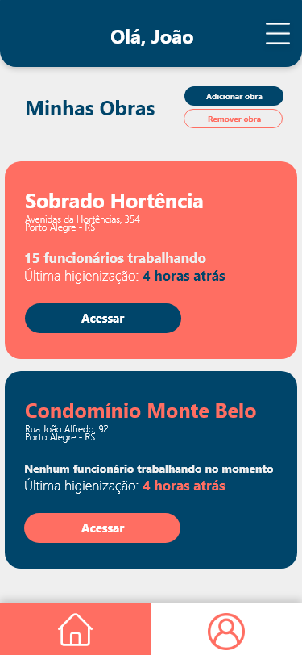

# AGS

    
  

  
  
  

> Projeto criado durante o [MegaHack 3.0 ](https://www.megahack.com.br/)realizado pela [Shawee](https://shawee.io/).

Aplicativo de Gestão Sanitária é voltado para Gestão Sanitária de pequenas e médias construtoras de edifícios residenciais e comerciais.

## 🎥 Video

[Video Pitch](https://www.youtube.com/watch?v=2kFvKTyPB04)

[Video Demo](https://www.youtube.com/watch?v=9o42o0RPYf0)

## 🌐 Web

[LandingPage](https://hackathon3ags.webflow.io/)

## 📱 Mobile

    
    

## ✒️ Protótipo

[Protótipo](https://xd.adobe.com/view/277780c0-d26c-4621-9270-87b55e61230a-7224/?fullscreen&hints=off)

## 📝 Documentação

[doc](.github/doc/desafio.pdf)

## 🚀 Equipe

[Eduarda Torres](https://www.linkedin.com/in/eduarda-torres/)

[José Julio](https://www.linkedin.com/in/josejuliommelazzo/)

[Lucas Vanni](https://www.linkedin.com/in/lucas-vanni-a66181145/)

[Luiz Pedro](https://www.linkedin.com/in/luizpedrosm/)
